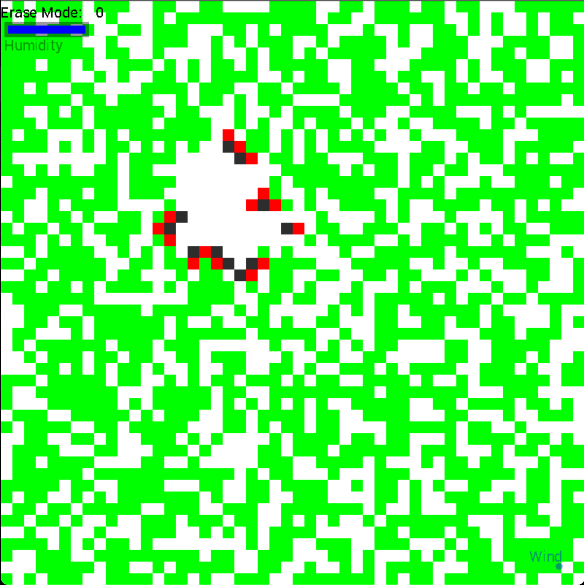

My project will consist on a simple World divided in smaller cells/blocks, that will each have a type,
- 0: empty
- 1: ash
- 2: forest
 
Empty being a cell that hypothetically and visually don't change (white color), ash the successor of a forest on fire (grey color) and forest a cell that can catch fire (any other cell can't catch fire) (green color), a forest on fire will be a state in which a forest can be in (red color).
 
The concept of the program is to simulate with various factors and events the propagation of a wild fire in a forest.
Assuming that the fire will be passed to a nearby forest cell if one of it's four adjacent cells is on fire:
 
```diff
 
 
           time: t         | empty  |+forest |+forest |+forest |
                           | -fire  |+forest | empty  |+forest |
                           |+forest |+forest |+forest | empty  |
                           |+forest |+forest |+forest |+forest |
                           | empty  |+forest | -fire  |+forest |
                           |+forest |+forest |+forest |+forest |
                           |+forest |+forest |+forest | empty  |
          
           time: t+1       | empty  |+forest |+forest |+forest |
                           |  #ash  | -fire  | empty  |+forest |
                           | -fire  |+forest |+forest | empty  |
                           |+forest |+forest | -fire  |+forest |
                           | empty  | -fire  |  #ash  | -fire  |
                           |+forest |+forest | -fire  |+forest |
                           |+forest |+forest |+forest | empty  |
```

In the process of the propagation of the fire will come in a factor/event of *Rain* controlled by a user click which will turn off fires depending on how much time it has been under the rain. *Rain* will be similar to *Fire*, it will be a state in which a block can be. But *Rain* here can be applied to whatever the type of the Block is, *Fire* can only be a state to a forest type block.
Other factors will come in, but will be discussed when added.

With each block having different types and states, for each of the blocks in a world we will have to look at it's neighbours to predict the next type it will have.
 
Let's initialize the size of the world (here 50), the number of forest (around a density of 60%) and DIMW the size of the window.
 
```c++
void world_init(World& w)
{
   int tmp_x, tmp_y;
   w.size = 50;
   w.forest_nb = round(0.6 * w.size*w.size);
   w.DIMW = DIMW;
 
```

Then with a simple iteration through every block we will initialize them to its corresponding coordinates.
And have every attribute initialized to false and 0 respectively for israining/onfire and type/fireToken.
 
```c++
   for (int i = 0; i < w.size; i++)
   {
       for (int j = 0; j < w.size; j++)
       {
           w.blocks[i][j].x1 = j * w.DIMW/w.size;
           w.blocks[i][j].x2 = w.blocks[i][j].x1 + w.DIMW/w.size;
           w.blocks[i][j].y1 = i * w.DIMW/w.size;
           w.blocks[i][j].y2 = w.blocks[i][j].y1 + w.DIMW/w.size;
           w.blocks[i][j].israining = false;
           w.blocks[i][j].onfire = false;
           w.blocks[i][j].type = 0;
           w.blocks[i][j].fireToken = 0;
       }
   }
```

Now that we have all blocks empty and not on fire and with no rain, let's add the forest type blocks. Picking randomly a block from the World till it's empty and changing it's type to 2 and this **forest_nb** times.

```c++
   for (int i = 0; i < w.forest_nb; i++)
   {
       do
       {
           tmp_x = rand() % w.size;
           tmp_y = rand() % w.size;
       }while(w.blocks[tmp_x][tmp_y].type != 0);
       w.blocks[tmp_x][tmp_y].type = 2;
   }
}
```
 
Drawing the world is a pretty simple concept, but we will add an interpolation concept to it for whether the block or the location we are looking at have rain in it :
First of all we simply check if the cell have it's attribute israining true or false.
If it is raining we simply interpole (with a choosen t value the higher t is the lower the blue will show) 2 Color structure the first one being the color of the cell based on it's type with a switch case that would do the job, and the second a blue color.
If it is not raining simply take the color for the appropriate type
And then with the coordinates we previously defined, draw a rectangle with the resulting color.

(can be done by getting the approp. color regardless the rain, and then interpoling with:
    if rain -> blue
    if notrain -> nothing) // not more efficiant but fewer key strokes

```c++
            if(w.blocks[i][j].israining)
            {
                switch(w.blocks[i][j].type)
                {
                    case 0:
                        intercolor = make_color(255, 255, 255); // empty -> white
                        break;
                    case 1:
                        intercolor = make_color(45, 45, 45); // ash -> grey
                        break;
                    case 2:
                        if (w.blocks[i][j].onfire) intercolor = make_color(255, 0, 0); // forest on fire -> red
                        else intercolor = make_color(0, 255, 0); // forest not on fire -> green 
                        break;
                }
                intercolor = interpolation_color(intercolor, make_color(0, 0, 255), 0.7);

                color(intercolor.r, intercolor.g, intercolor.b);
            }
            else
            {
                switch(w.blocks[i][j].type)
                {
                    case 0:
                        color(255, 255, 255); // empty -> white
                        break;
                    case 1:
                        color(45, 45, 45); // ash -> grey
                        break;
                    case 2:
                        if (w.blocks[i][j].onfire) color(255, 0, 0); // forest on fire -> red
                        else color(0, 255, 0); // forest not on fire -> green
                        break;
                }
            }
            rectangleFill(w.blocks[i][j].x1, w.blocks[i][j].y1, w.blocks[i][j].x2, w.blocks[i][j].y2);
```

Considering the rule that a fire can be passed through adjacent blocks *North South West Est*, the following will be the best way to update our world:
To simplify the notion of neighbors lets define 2 list, such as, iterated with a same index will give us all the possible combinations of a potential neighbor

```c++
int const nX[4] = {-1, 1, 0, 0};
int const nY[4] =  {0, 0, -1, 1};

e.g:

for (int n = 0; n < 4; n++){
    std::cout<<'('<<nX[n]<<', '<<nY[n]<<')'<<std::endl;
}

output:
(-1, 0)
(1, 0)
(0, -1)
(0, 1)

```


Now that we know how to acces all the neighbors of a given block, we can itterate through them all, with *i* *j* being the indexes in the blocks 2D array. First getting to know the type of the blovk with a switch is pretty smart thing to do to break it into different actions we would take. 

2. If it is a forest:
- if it is on fire -> it turns into ash set onfire to false and type-1
- if not on fire -> check for neighbors
    - if neighbor valid and then neighboron fire -> it catches fire set current block onfire to true
        - if the block is in a raining state -> +1 to it's token (wich indicates the number of itteration it hade under the rain)
        - if not raining -> set it's token back to 0
        - if the token of the block is greater than 3 (it has lived more than 3 itterations under the rain) -> it turns into ash

1. If it is ash:
- set it's token to 0
- it turns into empty block

0. If it is an empty block:
- Do nothing


```c++
            switch (w.blocks[i][j].type)
            {
                case 2:
                    if (w.blocks[i][j].onfire)
                    {
                        new_world.blocks[i][j].onfire = false;
                        new_world.blocks[i][j].type = w.blocks[i][j].type - 1;
                    }
                    else
                    {
                        for (int k = 0; k < 4; k++)
                        {
                            if (i - nX[k] >= 0 && i - nX[k] < w.size && j - nY[k] >= 0 && j - nY[k] < w.size)
                            {
                                if (w.blocks[i-nX[k]][j-nY[k]].onfire)
                                {
                                    new_world.blocks[i][j].onfire = true;
                                    if (w.blocks[i-nX[k]][j-nY[k]].israining) new_world.blocks[i][j].selfToken = w.blocks[i-nX[k]][j-nY[k]].selfToken + 1;
                                    else new_world.blocks[i][j].selfToken = 0;
                                    if (new_world.blocks[i][j].selfToken > 3)
                                    {
                                        new_world.blocks[i][j].onfire = false;
                                        new_world.blocks[i][j].type = w.blocks[i][j].type - 1; 
                                    }
                                }
                            }
                        }
                    }
                    break;
                
                case 1:
                    new_world.blocks[i][j].type = w.blocks[i][j].type - 1;
                    new_world.blocks[i][j].selfToken = 0;
                    break;
                case 0:
                    break;
            }
        }
    }
```
*i* and *j* taking the values of each cell in our blocks table.


In addition to the update of each cell, let's also give the ability for the user to make it rain. To do so let's get first of all by a left click the *i* and *j* indexes of the clicked cells,
in the **World.blocks[i][j]** table.


PS: This project includes the [Grapic](https://perso.liris.cnrs.fr/alexandre.meyer/grapic/html/index.html) library.
